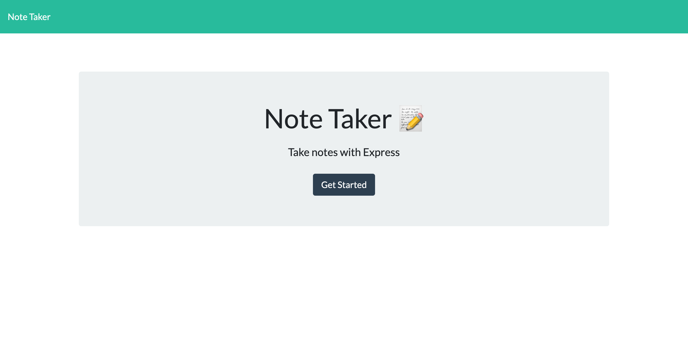
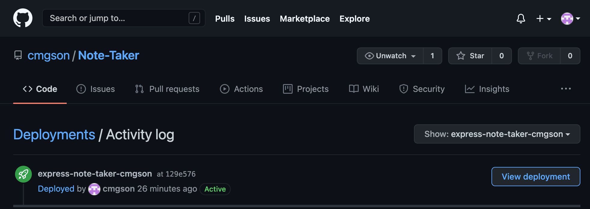

   

# 
 **Express Note Taker** 

--- 

--- 

## **Table Of Contents** 

---

1. [Description](#description)
2. [Installation](#installation)
3. [Usage](#usage)
4. [Contributing](#contributing)
5. [Tests](#tests)
6. [Review and Contribute](#github)
--- 

## 
  **Description** 
 

--- 

This app utilizes an express server to allow a client to take, update, delete, and alter notes which are in turn saved to a json file which can be returned upon launch.  The Note Taker utilizes several routes to deliver the base html to the client as well as api routes in order to handle the operations required of the note taker.

--- 
 
## 
  **Installation** 

--- 
 
to install simply install the dependencies by using 

`npm i`

--- 

## 
  **Usage** 

--- 

Once all dependencies are installed you can run the program by inputting 

`npm start`

in the command line.  This will initialize the server.  Once started, you can open up your browser and input

 `localhost:{PORT}`
 
  followed by the assigned port which is alerted in the command line upon launch.  From there input a title and then input notes.  Once finished, click the save icon in the top right corner.  From there you will notice that the notes title has been stored in the left column along with a red trash can icon.  From here you can either click on the note title itself to bring it up for editing or reading.  Also, with the trash can icon, you can delete any note off of the database you so choose.  These choices are updated dynamically making it easy for the client to modify them in real time.

--- 

## 
  **Contributing** 

--- 

licence attached to readme if interested in contribution.  Github and email below.

--- 

## 
  **Tests** 

--- 

--- 

## 
  **Github and Email** 

--- 

## 
 **Review and contribute here**

### _Github:_ [cmgson](https://github.com/cmgson)

### _Email:_ cmgson@yahoo.com

### Deployment Information
This app has been deployed on Heroku.

[Heroku Deployment click here](https://express-note-taker-cmgson.herokuapp.com/)

Here is where the deployment is located on Github.

--- 
